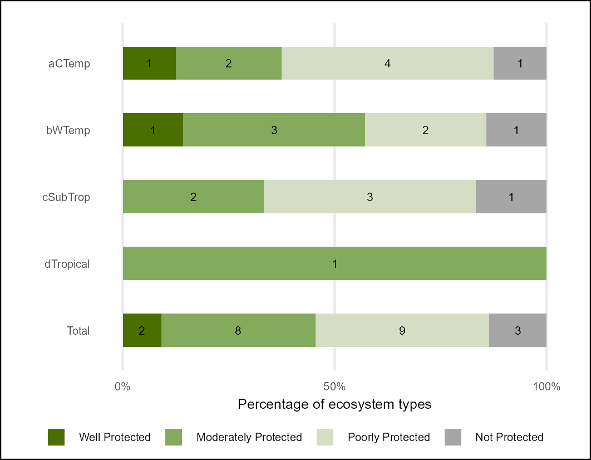
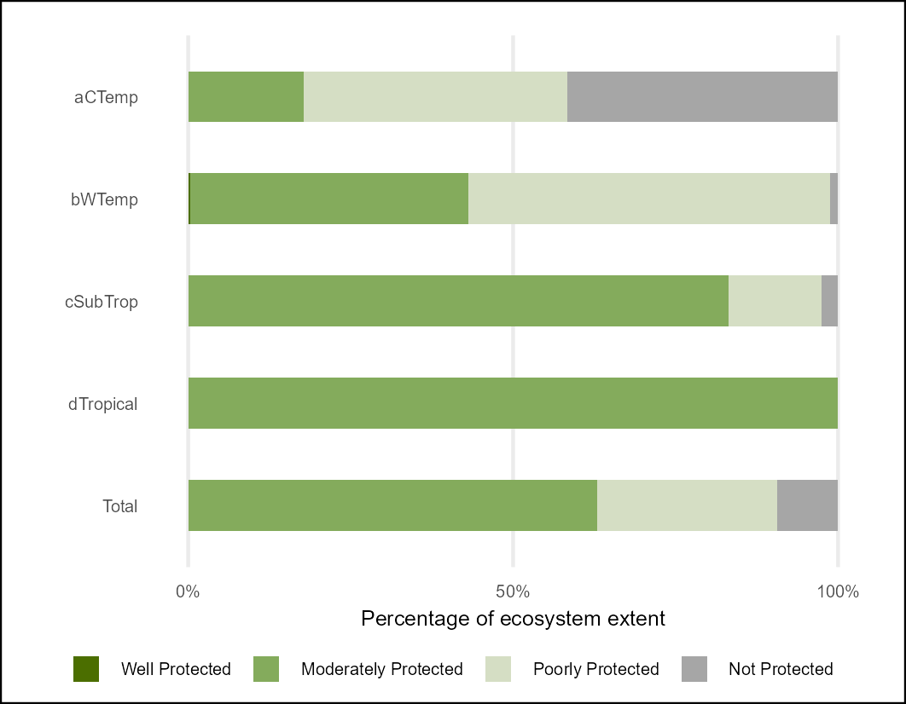
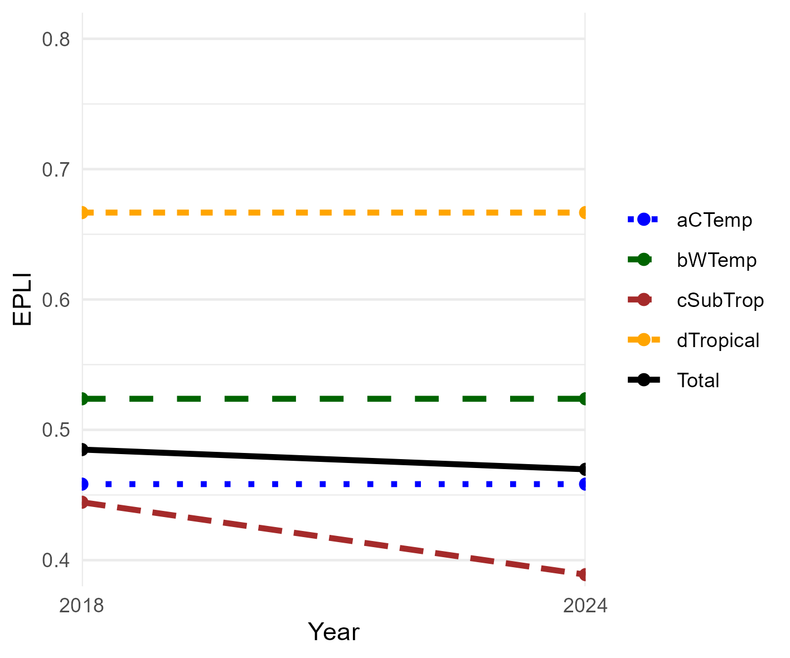

## **Workflows for undertaking the Estuarine Ecosystem Protection Level (EPL) assessment**

### **National Biodiversity Assessment - South Africa**

*Council for Scientific and Industrial Research (CSIR) and the South African National Biodiversity Institute (SANBI)*

July 2025

#### **Summary**

This repository contains a workflow that results in the NBA 2025 Ecosystem Protection Level indicators for Estuarine Ecosystems of South Africa following the methods of van Niekerk et al., 2019.

The Quarto document [EPL_estuaries.qmd](https://github.com/askowno/EPL_riv/blob/main/EPL_estuariest.qmd) describes the import of Protected Areas time series data - prepared in ARCPRO by SANBI - based on the South African Protected Areas Database (SAPAD) 2024Q4 (Department of Forestry Fisheries and Environment) and the import of the South African estuary spatial data (van Niekerk XXX) and Estuarine Health assessment tables. The data were combined (intersection) using the sf package in R and summarised using the tidyverse.

Estuarine Condition (Health) scores (0-100) are assigned to PES categories (A-F) and NBA Modification categories (Natural - Severely modified) according to the table below.

| Condition score (0-100) | "PES" category | Modification category        |
|-------------------------|----------------|------------------------------|
| \>= 90                  | A              | Natural                      |
| \>=75 & \< 90           | B              | Natural/Near Natural         |
| \>= 60 & \< 75          | C              | Moderately Modified          |
| \>=40 & \< 60           | D              | Heavily Modified             |
| \< 40                   | E/F            | Severely/Critically Modified |

Protection Level is an indicator developed in South Africa that measures the representation of ecosystem types within the PA network. The extent of each ecosystem type within the PA network is expressed as a proportion of the total extent. Four categories of Ecosystem Protection Level are calculated per ecosystem type (n= 22).

-   Well Protected: 100% of the PA target within PA network; AND only A&B condition estuaries contribute; AND areas under heavy and very heavy fishing pressure are excluded from contributing

-   Moderately Protected: 50% to 99% of PA target within the PA network; and A&B condition estuaries contribute 100%, C condition estuaries contribute 50%, D condition estuaries contribute 30% and E&F condition estuaries contribute 10%

-   Poorly Protected: 5% to 49% of PA target within the PA network; and A&B condition estuaries contribute 100%, C condition wetlands contribute 50%, D condition estuaries contribute 30% and E&F condition estuaries contribute 10%

-   Not Protected: less than 5% of PA target within the PA network; and A&B condition estuaries contribute 100%, C condition wetlands contribute 50%, D condition estuaries contribute 30% and E&F condition estuaries contribute 10%

The PA target was historically set at 20% for marine and estuarine ecosystems, but with the adoption of the 30% targets for Target 3 of the Global Biodiversity Framework - the PA target was increased to 30% in the EPL calculations (previous time points (2018) were recalculated using this higher target). Ecosystem condition data (van Niekerk et al., 2025) for each time point allow for only good condition estuaries without heavey fishing pressure (especially gill-netting) to be considered representative for Well Protected status; while for MP, PP and NP the condition of the estuaries is used to calculate their contribution to meeting targets such that higher integrity / condition estuaries contribute more to meeting PA targets than low integrity / condition estuaries.

#### **Results:**

Overall per-ecosystem type EPL results [epl_est_metrics_per_type.csv](outputs/epl_est_metrics_per_type.csv)

Summary table - count of estuarine ecosystem types per biogeographic zone per EPL category [epl24_est_sum_count.csv](outputs/epl24_est_sum_count.csv)

Summary table - extent of estuarine per biogeographic zone per EPL category [epl24_est_sum_ext.csv](outputs/epl24_est_sum_ext.csv)

Estuarine Ecosystem Protection Level 2025 - plots

| Count of Ecosystem Types per EPL category | Extent of Ecosystem Types per EPL category |
|----|----|
|  |  |

EPL Index - is not showing much change due lack of PA expansion in EFZ

